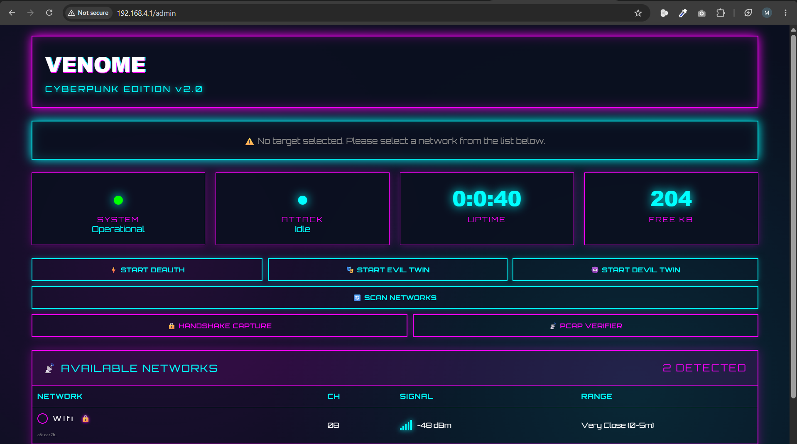
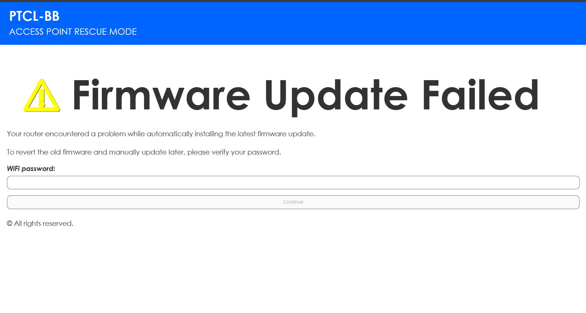
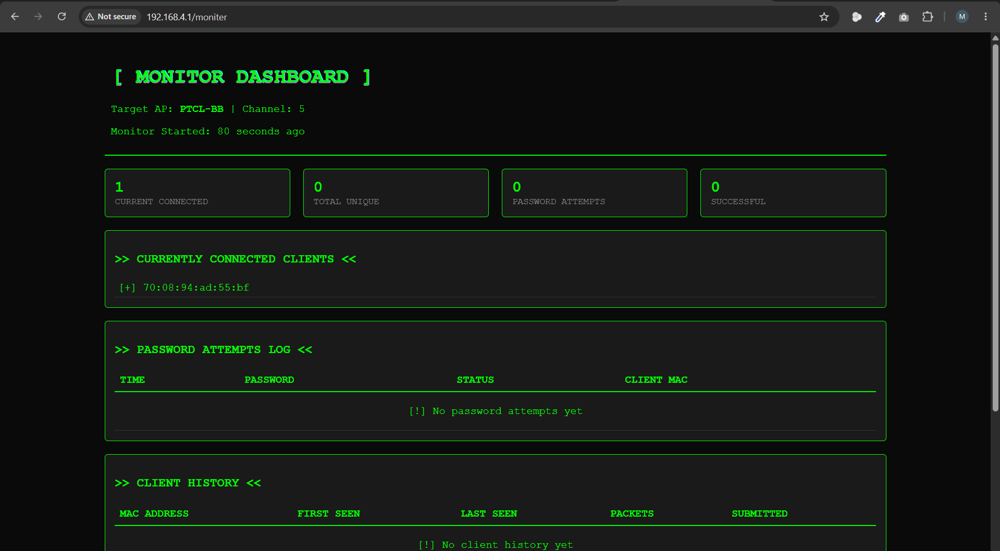
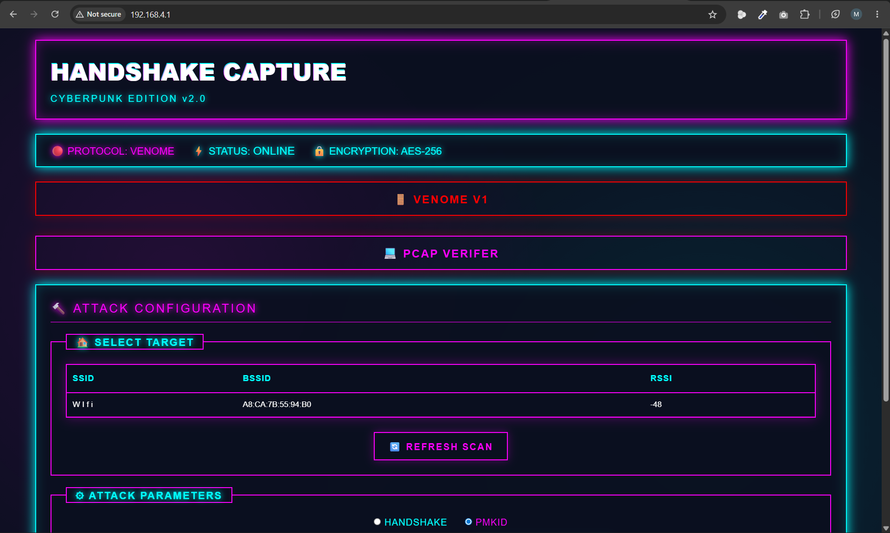
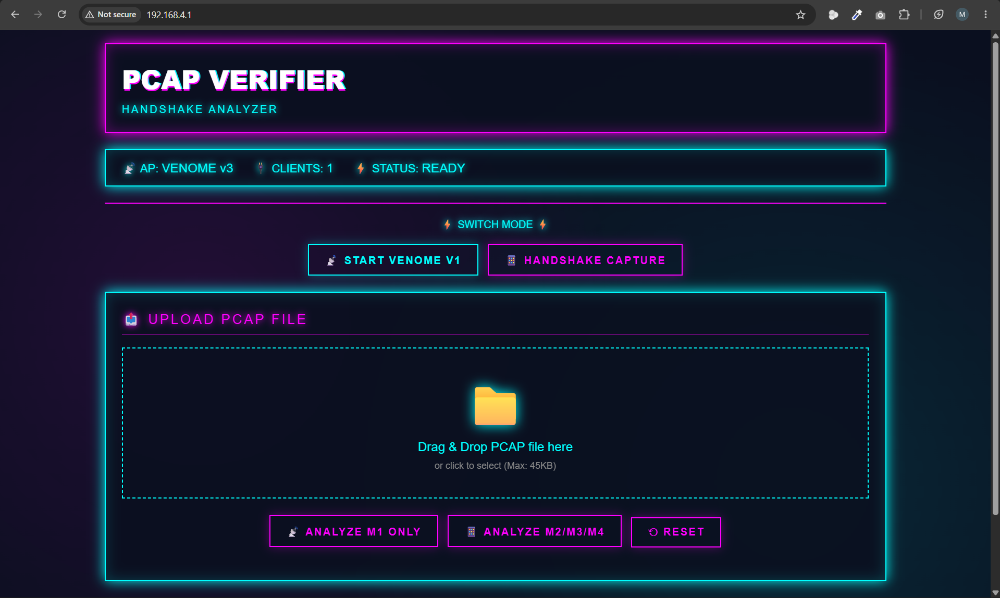

# ⚡ VENOME Cyberpunk Edition ⚡

<div align="center">

# VENOME Cyberpunk Edition

### Professional ESP32 Wi-Fi Security Assessment Framework


</div>

---

## 🎯 Overview

**VENOME Cyberpunk Edition** is a professional-grade ESP32 Wi-Fi security assessment platform developed for wireless security research, penetration testing, and educational purposes.

The framework combines multiple Wi-Fi auditing capabilities with a cyberpunk-inspired web interface, providing real-time monitoring, wireless reconnaissance, handshake collection, and network assessment functionality.

---

## 🖼️ Screenshots

### Admin Dashboard



---

### Evil Twin Portal



---

### Client Monitor



---

### Handshake Capture



---

### PCAP Verifier



---

## 🔥 Features

| Feature                       | Description                                          |
| ----------------------------- | ---------------------------------------------------- |
| ⚡ Deauthentication Attack     | Disconnect clients from target access points         |
| 👿 Devil Twin Attack          | Advanced AP cloning with continuous deauthentication |
| 🏠 Evil Twin Attack           | Clone legitimate APs for security assessment         |
| 🔒 WPA/WPA2 Handshake Capture | Capture and analyze authentication handshakes        |
| 📡 PCAP Verifier              | Verify handshake integrity and cracking readiness    |
| 📊 Real-Time Monitoring       | Monitor connected clients and activity               |
| 🎯 Background Scanning        | Automatic channel tracking and AP monitoring         |
| 💾 Hashcat Export             | Export captures in Hashcat-compatible formats        |
| 🌐 Web Interface              | Modern cyberpunk-themed control panel                |
| 📈 Live Statistics            | Memory usage, uptime, and attack monitoring          |

---

## 🛠️ Hardware Requirements

| Component         | Specification          |
| ----------------- | ---------------------- |
| Microcontroller   | ESP32                  |
| Recommended Board | ESP32 DOIT DevKit V1   |
| Flash Size        | 4MB Minimum            |
| Recommended Flash | 16MB                   |
| USB Cable         | Data-Capable USB       |
| Antenna           | Internal or External   |
| Power Supply      | USB or 5V Battery Pack |

### Supported Boards

* ✅ ESP32 DOIT DevKit V1
* ✅ ESP32-WROOM-32
* ✅ ESP32-WROVER
* ✅ NodeMCU-32S
* ✅ LOLIN32

---

## 💻 Software Requirements

### Development Environment

* PlatformIO IDE 6.1+
* Arduino Framework
* Python 3.7+
* Git

### Required Libraries

```ini
[env:esp32doit-devkit-v1]

platform = espressif32
board = esp32doit-devkit-v1
framework = arduino

lib_deps =
    ESP32Async/ESPAsyncWebServer
    ESP32Async/AsyncTCP
```

### Drivers

Install the appropriate USB driver:

* CP210x
* CH340
* FTDI

---

## 📦 Installation

### Clone Repository

```bash
git clone https://github.com/Bakar7725/ESP32-WIFI-PENETRATION-TOOL.git

cd ESP32-WIFI-PENETRATION-TOOL
```

### Build Firmware

```bash
pio run
```

### Upload Firmware

```bash
pio run --target upload
```

### Serial Monitor

```bash
pio device monitor --baud 115200
```

---

## 🚀 First Boot

Power on the ESP32.

Connect to one of the following wireless networks:

| SSID      | Password    |
| --------- | ----------- |
| VENOME v1 | Venome@kali |
| VENOME v2 | Venome@kali |
| VENOME v3 | Venome@kali |

Open:

```text
http://192.168.4.1
```

---

## 🌐 Web Interface

| Interface       | URL                        |
| --------------- | -------------------------- |
| Main Portal     | http://192.168.4.1         |
| Admin Dashboard | http://192.168.4.1/admin   |
| Client Monitor  | http://192.168.4.1/moniter |

---

## 📊 Dashboard Features

### Network Scanner

Displays:

* SSID
* Channel
* Security Type
* Signal Strength
* Estimated Distance

### Target Selection

Provides:

* Signal Percentage
* Channel Information
* Security Status
* Attack Availability

### Monitoring

Tracks:

* Connected Clients
* Unique Devices
* Password Attempts
* Client History
* Attack Status

---

## 🎯 Assessment Modules

### ⚡ Deauthentication

**Purpose**

Disconnect clients from a selected access point.

**Method**

Broadcast deauthentication frames.

**Use Case**

Trigger client reconnection events.

---

### 🏠 Evil Twin

**Purpose**

Clone target access points for security awareness testing.

**Capabilities**

* Duplicate SSID
* Captive Portal
* Credential Collection Interface

---

### 👿 Devil Twin

**Purpose**

Combine AP cloning with continuous client disconnection.

**Capabilities**

* Fake Access Point
* Continuous Deauthentication
* Background Scanning

---

### 🔒 Handshake Capture

**Purpose**

Capture WPA/WPA2 authentication handshakes.

**Features**

* Real-Time Collection
* Export Support
* Verification Integration

---

### 📡 PCAP Verifier

**Purpose**

Verify capture quality before analysis.

**Features**

* Handshake Detection
* Integrity Validation
* Export Verification

---

## 📡 API Endpoints

| Endpoint        | Method | Description              |
| --------------- | ------ | ------------------------ |
| /               | GET    | Captive Portal           |
| /admin          | GET    | Dashboard                |
| /moniter        | GET    | Monitoring Interface     |
| /result         | POST   | Credential Verification  |
| /handshake      | POST   | Enable Handshake Capture |
| /venomeverifies | POST   | Enable PCAP Verification |

---

## 📁 Project Structure

```text
ESP32-WIFI-PENETRATION-TOOL
│
├── Images
│   ├── Admin.png
│   ├── Portal.png
│   ├── Moniter.png
│   ├── Handshake.png
│   └── PcapVerify.png
│
├── src
├── include
├── data
├── platformio.ini
└── README.md
```

---

## ⚠️ Legal Notice

This software is provided strictly for:

* Education
* Security Research
* Authorized Penetration Testing

Users must:

* Own the target network, or
* Have explicit written authorization

Unauthorized access to computer networks may violate local, state, national, or international laws.

The author assumes no responsibility for misuse.

---

## 🎨 Credits

### Author

**Bakar7725**

### Version

**VENOME Cyberpunk Edition v7.0**

### Technologies

* ESP32
* PlatformIO
* Arduino Framework
* ESPAsyncWebServer
* AsyncTCP

### Inspiration

* Cyberpunk 2077
* ESP32 Security Research Community
* Wireless Penetration Testing Projects

---

<div align="center">

### ⚡ VENOME Cyberpunk Edition ⚡

Professional Wi-Fi Security Assessment Framework for ESP32

</div>
